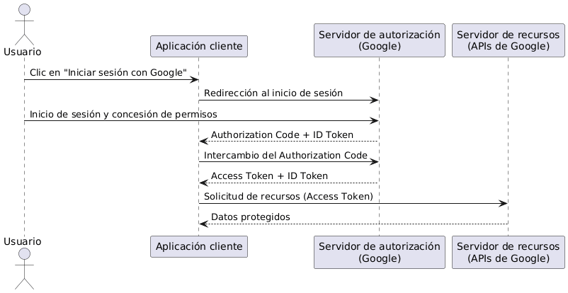
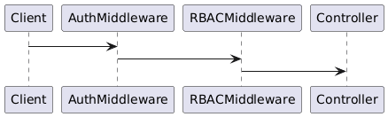

# Autenticación y Autorización

## Autenticación vs Autorización

- **Autenticación**: responde a la pregunta **¿quién eres?**
- **Autorización**: responde a la pregunta **qué puedes hacer?**

Ambos conceptos son diferentes, pero trabajan juntos en sistemas modernos.

## OAuth: Delegación de Acceso

### Problema original
Antes de OAuth, las aplicaciones pedían usuario y contraseña para acceder a recursos de otras plataformas (ej. contactos de Google), lo cual era inseguro

### OAuth 1.0
**Ventajas**
- Eliminó la necesidad de compartir contraseñas
- Introdujo delegación de acceso con permisos

**Limitaciones**
- Muy complejo de implementar
- Uso de firmas criptográficas propensas a errores

---

### OAuth 2.0 (2010)

OAuth 2.0 simplificó enormemente el modelo

**Cambios clave**
- Introducción de **Bearer Tokens**
- Menor seguridad teórica, pero mucha más simplicidad práctica

**Flujos principales**
- **Authorization Code Flow** -> aplicaciones server-side
- **Implicit Flow** -> aplicaciones browser-based (desaconsejado hoy)
- **Client Credentials Flow** -> machine-to-machine
- **Device Code Flow** -> dispositivos sin teclado (Smart TV)

> OAuth 2.0 resuelve **autorización**, no autenticación

---

## OpenID Connect (OIDC)

### El problema
OAuth solo indica **qué puede hacer** un usuario, no **quién es**

---

### La solución
**OpenID Connect** se construye sobre OAuth 2.0 y añade autenticación

#### ID Token
- Es un **JWT**
- Contiene información de identidad:
  - user_id
  - nombre
  - email
  - issuer
  - issued_at
  - etc.

### Ejemplo: Sign in with Google

- El usuario hace clic en *Sign in with Google*
- Es redirigido al Authorization Server de Google
- Inicia sesión y concede permisos
- Google devuelve:
   - Authorization Code
   - ID Token
- El cliente intercambia el code por:
   - Access Token
   - ID Token (si no se recibió antes)
- La app:
   - Usa el **ID Token** para autenticar
   - Usa el **Access Token** para acceder a recursos

## Cuándo usar cada tipo de autenticación

| Tipo | Uso recomendado |
|----|----|
| Stateful (Session ID) | Web apps tradicionales |
| Stateless (JWT) | APIs distribuidas y escalables |
| OAuth / OIDC | Login con Google, Facebook, Discord |
| API Keys | Server-to-server |

## Autorización

No todos los usuarios deben tener los mismos permisos

Ejemplos:
- Usuario normal
- Moderador
- Administrador

Usar strings secretos o claves mágicas:
-  No escala
-  Es inseguro
-  Difícil de mantener

## RBAC – Role Based Access Control

### Concepto
Los permisos se asignan a **roles**, y los roles a usuarios

**Ejemplo**
- User -> leer
- Moderator -> leer + escribir
- Admin -> leer + escribir + borrar + acceso especial

### Flujo típico RBAC

- Usuario se autentica
- El servidor identifica su rol
- El rol se adjunta al request
- El endpoint valida permisos
- Si no tiene acceso -> `403 Forbidden`

## Seguridad en Autenticación

### Mensajes de error

   NO:
- "Usuario no encontrado"
- "Contraseña incorrecta"

   SÍ:
- "Authentication failed"

Evita **user enumeration attacks**

---

## Timing Attacks

### Problema
Diferencias de tiempo revelan:
- Si el usuario existe
- Si la contraseña es incorrecta

### Defensas

1. Comparaciones en **tiempo constante**
2. Simular delays para igualar tiempos de respuesta

