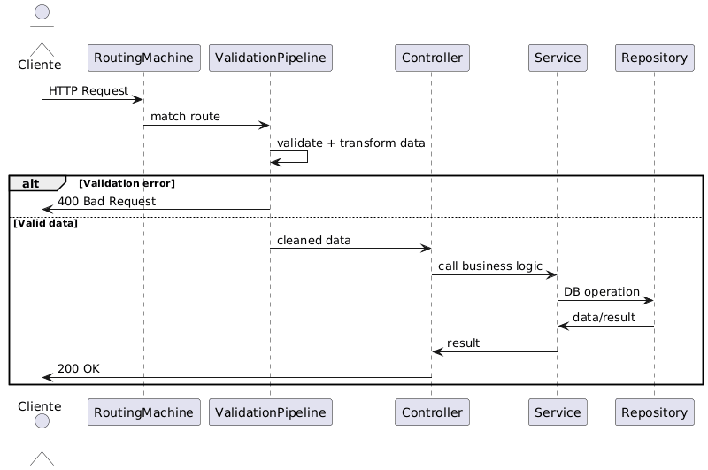

# Validaciones y Transformaciones en APIs Backend

## Arquitectura básica del backend

Un backend típico se divide en capas:

### Repository Layer
- Maneja la base de datos
- Ejecuta queries (insert, update, delete, select)
- Puede ser SQL, NoSQL, Redis o otro almacenamiento
- No contiene lógica de negocio

### Service Layer
- Contiene la lógica de negocio
- Llama a uno o más repositories
- Puede enviar emails, notificaciones, webhooks, etc
- Define qué hace realmente cada API

### Controller Layer
- Maneja HTTP
- Recibe requests del cliente
- Retorna responses
- Decide códigos HTTP
- Aplica validaciones y transformaciones
- Llama al service layer

---

## Dónde ocurren las validaciones y transformaciones

- Cuando la request entra al servidor
- Después del route matching (recibe la request, compara la ruta y la envía al handler correcto)
- Antes de ejecutar lógica de negocio
- Antes de llamar al service layer o repository

Objetivo: **no ejecutar nada importante si los datos no son válidos**

---

## Qué datos se validan

Todo lo que venga del cliente:
- JSON body
- Query parameters
- Path parameters
- Headers

Nada de esto es confiable por defecto

---

## Por qué validar

Si NO se valida:
- Datos incorrectos llegan a la base de datos
- La base de datos falla
- El backend responde con error 500
- Mala experiencia para el cliente

Si se valida:
- Se detectan errores temprano
- Se responde con 400 (Bad Request)
- Se explica qué campo está mal
- Se protege la integridad del sistema

---

## Ejemplo básico de validación

API espera:

{
  "name": "string (5 a 100 caracteres)"
}

Validaciones:
- `name` es obligatorio
- Debe ser string
- Longitud entre 5 y 100

Si falla:
- Se devuelve error inmediatamente
- No se ejecuta lógica de negocio

---

## Tipos de validaciones

### Validación sintáctica
Revisa el formato del dato

Ejemplos:
- Email válido
- Teléfono con formato correcto
- Fecha con estructura válida (YYYY-MM-DD)

Solo revisa la forma, no el significado

---

### Validación semántica
Revisa si el dato tiene sentido

Ejemplos:
- Fecha de nacimiento no puede estar en el futuro
- Edad no puede ser 430
- Rangos lógicos (edad entre 1 y 120)

---

### Validación de tipos
Revisa el tipo de dato

Tipos comunes:
- String
- Number
- Boolean
- Array
- Object

Ejemplos:
- Se espera número y llega string
- Se espera array y llega valor simple
- Se valida el tipo de los elementos del array

---

## Validaciones complejas

Dependen de otros campos

Ejemplos:
- `password` y `confirmPassword` deben coincidir
- Si `married = true`, `partner` es obligatorio
- Si `married = false`, `partner` es opcional

---

## Transformaciones

Transformar = modificar los datos antes de usarlos

Ejemplo:
- Query params siempre llegan como string

Request:
?page=2&limit=20

Llega al backend como:
"2", "20"

El backend:
- Convierte string => number
- Luego valida rangos

---

## Ejemplos de transformaciones

- Email => lowercase
- Agregar `+` al teléfono
- Convertir strings a números
- Cambiar formato de fechas
- Limpiar espacios innecesarios

Esto se hace antes de la lógica de negocio

---

## Pipeline de validación y transformación

- Validación y transformación van juntas
- Todo el input se procesa en un solo lugar
- El controller recibe datos limpios
- El service layer no se preocupa por formatos

---

## Frontend validation vs Backend validation

### Frontend validation
- Mejora la UX
- Feedback inmediato al usuario
- No es segura
- Puede omitirse (Postman, scripts)

### Backend validation
- Obligatoria
- Seguridad e integridad de datos
- No depende del cliente
- Siempre debe existir

Nunca confiar solo en validaciones del frontend

---

