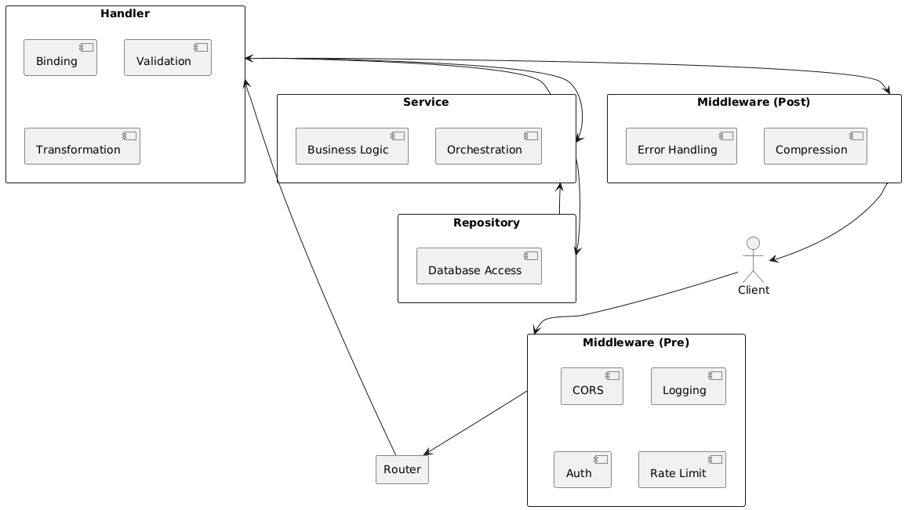
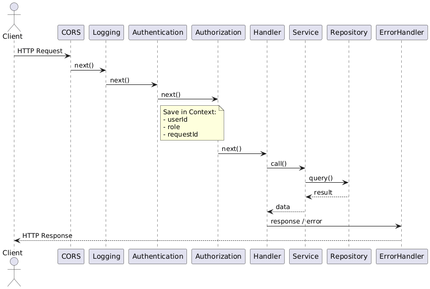

# Backend Architecture: Handlers, Services, Repositories, Middleware y Request Context

## 1. Ciclo de vida de una Request (Request Lifecycle)

1. El cliente envía una request HTTP
2. El sistema operativo la redirige al puerto donde escucha el servidor
3. La request entra al **entry point** del servidor
4. Pasa por una cadena de **middlewares**
5. Llega al **router**, que decide qué handler ejecutar
6. El **handler/controller** procesa la request usando:
   - Service layer
   - Repository layer
7. Se genera una response
8. La response vuelve a pasar por middlewares
9. El servidor envía la response al cliente

---

## 2. Handler / Controller

### Responsabilidades
- Recibe:
  - `request`
  - `response`
- Extrae datos de la request:
  - Query params (GET)
  - Body (POST, PUT, PATCH, DELETE)
  - Path params
- **Deserializa / Binding**
  - Convierte JSON => estructura nativa (struct, objeto, dict, etc..)
- **Validación**
  - Campos obligatorios
  - Tipos correctos
  - Datos válidos
- **Transformación**
  - Setear valores por defecto
  - Normalizar datos para capas inferiores
- Llama al **Service layer**
- Decide el **HTTP status code**
- Construye y envía la response

### Qué NO debe hacer
- Lógica de negocio
- Queries a la base de datos
- Decisiones complejas de negocio

---

## 3. Service Layer

### Responsabilidades
- Contiene la **lógica de negocio**
- No conoce nada de HTTP
- No maneja status codes
- Orquesta:
  - Llamadas a repositorios
  - Llamadas a APIs externas
  - Envío de emails, notificaciones, etc...
- Puede usar múltiples repositorios
- Devuelve datos procesados al handler

### Buenas prácticas
- Desde el código no debería notarse que es usado por una API
- Funciones puras orientadas a negocio

---

## 4. Repository Layer

### Responsabilidades
- Interactúa directamente con la base de datos
- Construye queries
- Ejecuta operaciones CRUD
- Devuelve resultados de la DB

### Principios
- **Single Responsibility**
- Un método = un tipo de operación
  - `getAllBooks()`
  - `getBookById(id)`
  - `createBook(data)`
- No mezclar multiples comportamientos en un solo metodo

---

## 5. Middleware

### Qué es
Funciones que se ejecutan **entre**:
- Entry point
- Routing
- Handlers
- Response final

### Reciben
- `request`
- `response`
- `next()` => pasa la ejecución al siguiente middleware/handler

### Qué pueden hacer
- Leer/modificar request
- Leer/modificar response
- Terminar la request antes del handler

---

## 6. Casos comunes de Middleware

### CORS
- Verifica el `Origin`
- Agrega headers de seguridad
- Se ejecuta primero

### Security Headers
- Content-Security-Policy
- X-Frame-Options
- Etc

### Authentication
- Valida token / credenciales
- En error => responde `401`
- En éxito => guarda datos en el request context

### Rate Limiting
- Limita requests por IP
- En exceso => `429 Too Many Requests`

### Logging & Monitoring
- Log de:
  - Método
  - Path
  - Params
  - Tiempo
- Auditoría y debugging

### Global Error Handling
- Último middleware
- Captura errores de cualquier capa
- Responde:
  - `400` => error del cliente
  - `500` => error del servidor
- Devuelve errores estructurados

### Compression
- Comprime responses grandes (gzip, etc.)

### Serialization / Validation Middleware (opcional)
- Mueve lógica común fuera de handlers

---

## 7. Orden de Middlewares (muy importante)

Orden típico:
1. CORS
2. Logging
3. Authentication
4. Rate Limiting
5. Routing
6. Handlers
7. Global Error Handler (último)

---

## 8. Request Context

### Qué es
- Estado compartido **limitado a una request**
- Accesible desde:
  - Middlewares
  - Handlers
  - Services

### Qué se guarda
- `userId`
- `userRole`
- `permissions`
- `requestId`
- Deadlines / cancel signals

### Por qué es importante
- Evita acoplamiento fuerte
- Permite compartir información sin pasar parámetros manualmente
- Mejora seguridad

### Ejemplo
- Auth middleware:
  - Valida token
  - Guarda `userId` y `role` en el context
- Handler:
  - Obtiene `userId` desde el context
  - NO desde el body del cliente

### Request ID
- Generado al inicio
- Usado para:
  - Logs
  - Trazabilidad
  - Debugging en microservicios

---

## 9. Resumen de responsabilidades

| Capa | Responsabilidad |
|-----|----------------|
| Handler | HTTP, validación, response |
| Service | Lógica de negocio |
| Repository | Base de datos |
| Middleware | Lógica transversal |
| Context | Estado por request |

---

## 10. Idea clave
Separar responsabilidades:
- Código más limpio
- Más mantenible
- Más escalable
- Más seguro
